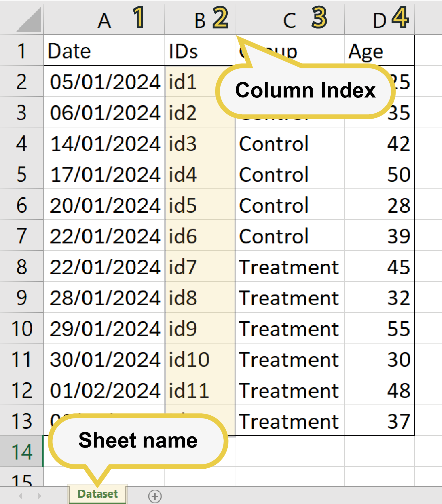
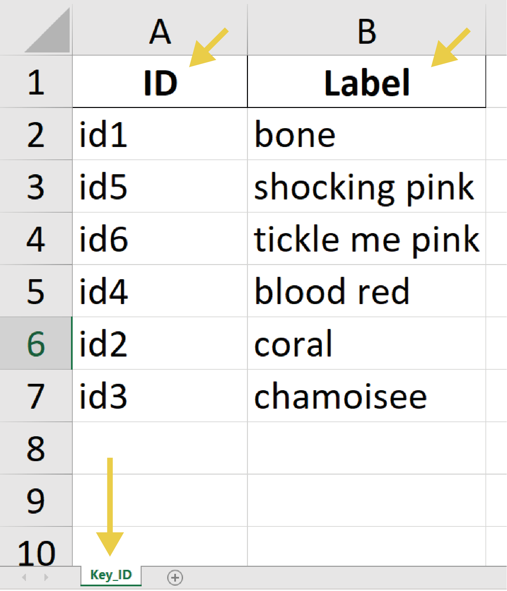

<div style="text-align: center;">
    
</div>

[](https://zenodo.org/doi/10.5281/zenodo.10257108)


## Data Blinding Make Effortless and Seamless

In research, the expectation of specific results, can unintentionally skew the experiment by significantly overestimating the effect size 
(e.g., [Saltaji et al., 2018](https://doi.org/10.1186%2Fs12874-018-0491-0), [Macleod et al., 2008](https://doi.org/10.1161/STROKEAHA.108.515957)). 
Therefore, minimizing detection bias, by blinding data from individuals involved in outcome assessment, enhances the internal validity of the data analysis ([Bespalov et al., 2020](https://doi.org/10.1007/164_2019_279)).

One of the biggest challenges of masking the data is the hassle and the need to involve another person. Not anymore.
 Now, you can easily conduct a partially blinded study with the help of inBlindSight, by automating the blinding of result assessment and data analysis.

## Features

inBlindSight is a locally operated Python script with an easy-to-use graphical user interface that:

- **Random ID-Label Assignment**: Assigns unique IDs to labels and exports the key of ID-label pairs to an Excel file
- **Data Blinding and Unblinding**: Facilitates blinding and unblinding of data by renaming columns in Excel files or
  by renaming files in folders using the generated key of ID-label pairs

## Instructions

### How to Install

**Windows**

1. **Download**: Get the latest .exe file [here](https://github.com/AlexHenriques/IDBlindingTool/releases)
2. **Installation**: Simply, run the downloaded file (inBlindSight.exe) and follow the installation steps

**macOS**

1. **Download**: Click on the green "Code" button and download the ZIP file to a directory (folder).
2. **Installation**:
   - Optional: Install [Josefin Sans](https://fonts.google.com/specimen/Josefin+Sans)
   1. Ensure you have [Python](https://www.python.org/downloads/macos/) 3.6 or higher installed on your system, as it is necessary to run the script
   2. Open a terminal (use Command + Space to bring up Spotlight and search 'Terminal') and navigate to the directory 
where the tool is located by typing `cd "/path/to/the/directory/"` in the terminal and pressing Enter
   3. In the terminal, type `pip install -r requirements.txt` and press Enter to run
3. **Run**: Execute the tool by typing `python inBlindSight.py` on the terminal and pressing Enter to run

**Note**: This tool has only been tested on Windows. While it should also work on macOS, please note that it has not 
been extensively tested on macOS. If you encounter any issues or unexpected behavior while running the tool on macOS, 
feel free to report them on the project's [issues](https://github.com/AlexHenriques/IDBlindingTool/issues).

### How to Use

#### How to create a key

1. **Go to the Generate Key page**: Click on the 'Generate Key' button on the landing page.
2. **Load IDs**: In the Identifiers section, you have two options to input IDs:
   1. **Manual Input**: Enter the IDs manually into the text entry field. Each ID should be separated by a comma 
      (e.g., text1,text2,...,textn).
      Click on the 'Insert IDs' button to add the IDs in the text entry field. You can input IDs in batches or in one time.
   2. **Import File**: Click on the 'Import IDs' labels to select an Excel file.
3. **Load Custom Labels**: By default, there are 3 themes of labels (928 animals, 509 colors, 201 countries). Custom labels can be inputted like IDs, after the 
   Labels panel is revealed by clicking on the 'Use Default Labels' switch.
4. **Generate key**: Once there are enough labels to pair with the IDs, you can press on the 'Create Key' button.  
   Then, choose a name and a location to save the key file.

More on the [**input** formats](#input-format-of-ids-and-labels) of IDs and labels

More on the [**file** formats](#file-format-of-ids-and-labels) of IDs and labels

#### How to rename a dataset or files within a folder

1. **Go to the Rename Datasets or Files page**: Click on the 'Rename Datasets or Files' button on the landing page.
2. **Load Key**: Click on the 'Import Key' button and select the key file.
3. **(Un)Blind**: Decide whether the IDs will be replaced by labels ('Blind') or vice versa ('Unblind').
4. **Rename**: From here you have two options:
   1. **Datasets**: After specifying the localization of the IDs within the Excel by typing the **sheet** and **column** 
      number on the text entry field, click on the 'Rename Dataset' button. You can overwrite the original dataset or create a new one.
   2. **Files**: Click on the button **Rename Files** and then select a folder in which the files to rename are.

More on the [format](#file-format-of-keys) of a key file

#### Suggestion: How to successfully rename a dataset with multiple IDs

1. Create a key for each ID variable to blind.
2. Rename all the ID variables one by one using the respective keys.

#### Suggestion: How to truly do a blind data analysis

After masking the identifiers:
1. Blind group allocation
2. Statistical analysis: group comparisons
3. Unblind group allocation by checking the key 

### Formatting Guidelines

#### Input format of IDs and labels

- IDs and labels are **case** and **space** **sensitive**
- IDs and labels **cannot** have leading or trailing spaces
- Commas **cannot** be used in IDs or labels (i.e. 'John,Smith' is considered 2 entries)

##### File format of IDs and labels

- IDs or Labels must be separated by rows
- First row can be a header
- File Formats: .csv, .xls, or .xlsx




##### File format of keys

- On the **first** sheet, on the **first** column are the IDs and on the **second** column are the labels
- First row can be a header
- File Formats: .xlsx, .xls or .csv



#### Code Explanation

inBlindSight guarantees reliable data blinding through the following steps:

1. **Eliminating Duplicates**: Ensures that the lists of IDs and labels do not contain duplicates
2. **Random Label Selection**: Randomly selects the required number of labels from a list of shuffled labels
3. **Pairing IDs and Labels**: Establishes random connections between IDs and labels, creating a key for further use
4. **New & Shuffled Dataset**: Creates a new dataset by randomly shuffling the rows of the original dataset
5. **Randomly Sorted Folder**: Rearranges a folder ordered by name, leading to a result assessment in a random order

**Note**: Your data remains secure as all processing is done locally on your computer

```python
random.shuffle(labels_list)
random_label_selection = random.sample(labels_list, len(ids_list))
id_label_pairs = list(zip(ids_list, random_label_selection))

random.shuffle(rows_shuffled)
shuffled_df = pd.DataFrame(rows_shuffled, columns=df.columns)
```

## Bugs & Feature Requests

Your feedback is crucial to improve the tool's functionality and to fix any problems

If you find a bug, please open an issue [here](https://github.com/AlexHenriques/IDBlindingTool/issues)

If you'd like to request a new function, feel free to do so by opening an issue [here](https://github.com/AlexHenriques/IDBlindingTool/issues)

As an alternative, you can [email me](mailto:alexandresshenriques@gmail.com)

I'm committed to consistently update and enhance inBlindSight in response to feedback, making sure it stays useful and relevant

## Want to contribute?

Great! Just follow these steps:

- Fork this repository
- Create a new branch: `git checkout -b new-feature`
- Make the changes
- Commit the changes: `git commit -am 'New feature'`
- Push to the branch: `git push origin new-feature`
- Create a Pull Request

## Future Directions

- **Current Focus**: The tool only focuses on blinding identifiers, which are variables that uniquely identify each entity within the dataset. 
- **Limitation**: For a blinded data analysis not conducted by an independent analyst, random codding of entities and experimental groups
 is a strategy of **moderate** quality ([Karp et al., 2022](https://doi.org/10.1371/journal.pbio.3001873)), as differences between experimental group remain apparent.
 For example, in a blinded categorical variable (e.g., country), entities sharing the same value will still share the same label.
 In such cases, more sophisticated statistical and computational methods are required.
- **Recommendation**: Consider deleting all the non-relevant information from the working datasets and then blind the IDs.
- **Planned Future**: To create a one-stop shop, randomization of group allocation with or without blocking will be implemented.
 Potential features include help buttons that offers contextual hints on hover, compatibility with .sqlite & .db datasets, and implementation of a protected key.
 These can be added upon request.

## Citation

For citation, refer to [Zenodo](https://zenodo.org/doi/10.5281/zenodo.10257108) or [CITATION.cff](CITATION.cff). 
You can also click on 'Cite this repository' located on the top-left of the repository

## Contact

Alexandre Henriques - [email](mailto:alexandresshenriques@gmail.com)

## License

This project is licensed under the MIT License - see the [LICENSE](LICENSE) file for details
